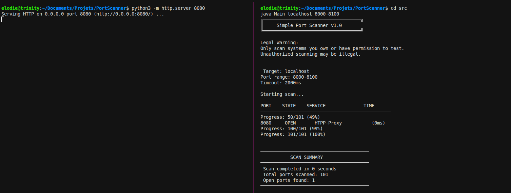
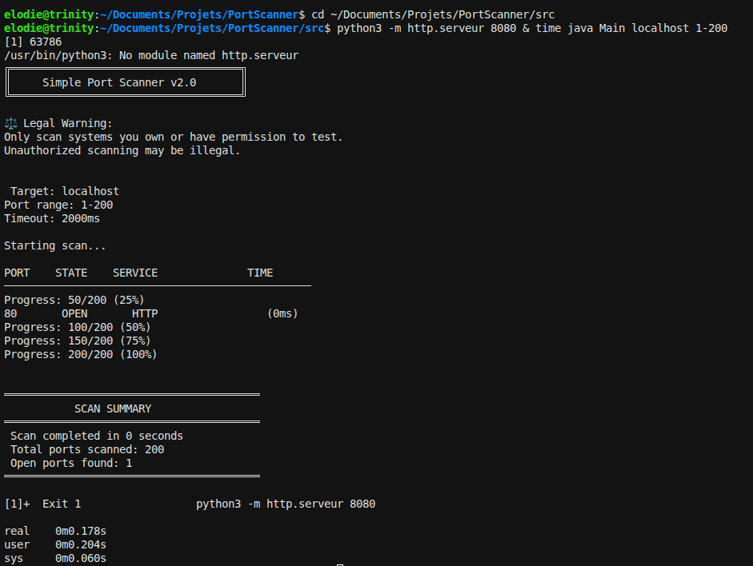
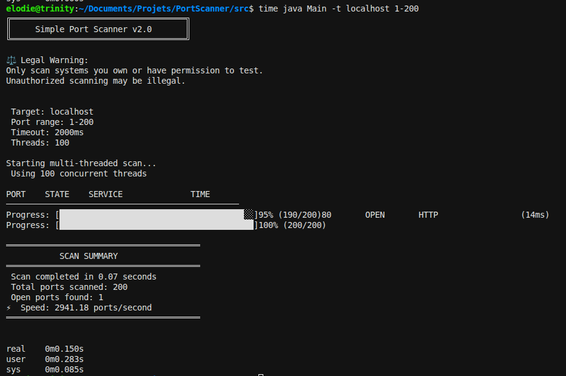
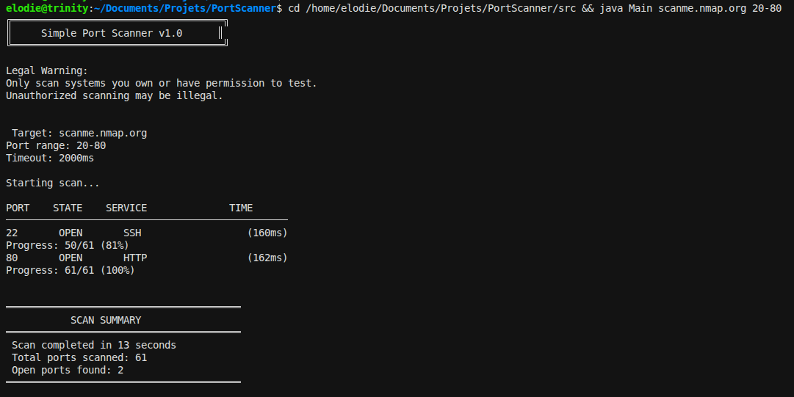
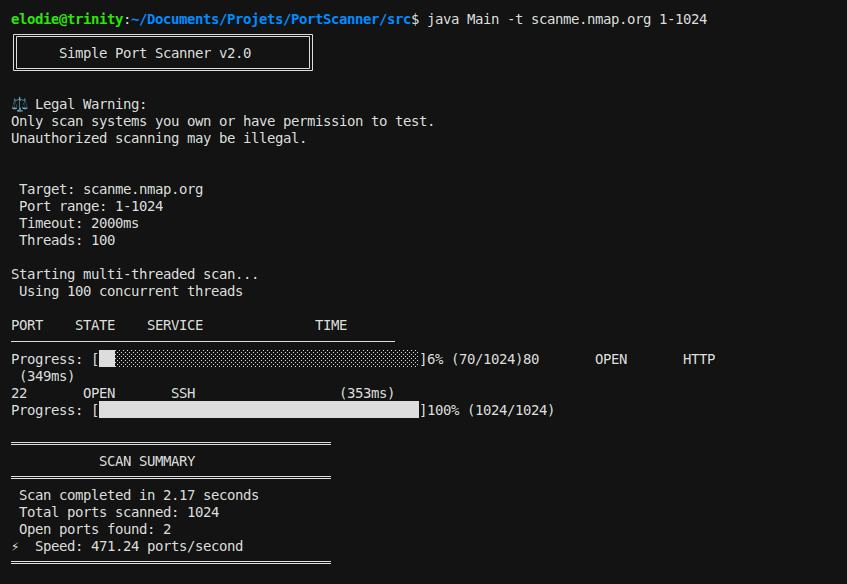
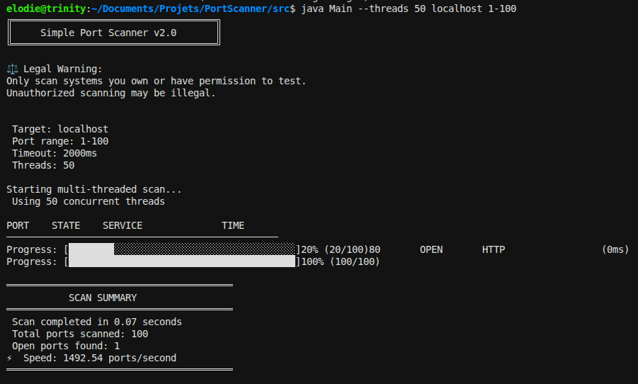
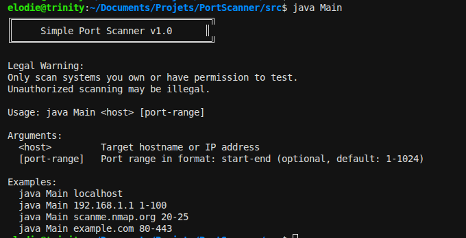

# 🔍 Java Port Scanner

[](https://www.java.com)
[](LICENSE)
[]()
[]()

A high-performance TCP port scanner written in Java for educational purposes. Features both sequential and multi-threaded scanning with up to 100x performance improvement. This project demonstrates network programming concepts, socket operations, and cybersecurity reconnaissance techniques.



---

## Table of Contents

- [About](#about)
- [Features](#features)
- [Architecture](#architecture)
- [Installation](#installation)
- [Usage](#usage)
- [Examples](#examples)
- [Technical Details](#technical-details)
- [Legal Disclaimer](#legal-disclaimer)
- [Learning Outcomes](#learning-outcomes)
- [Roadmap](#roadmap)
- [Contributing](#contributing)
- [Author](#author)

---

## About

This port scanner was developed as a hands-on learning project to explore:

- **Network Programming**: Understanding TCP/IP protocols and socket programming
- **Cybersecurity Fundamentals**: Learning reconnaissance techniques used in penetration testing
- **Object-Oriented Design**: Implementing clean architecture with separation of concerns
- **Exception Handling**: Managing network timeouts, connection failures, and edge cases

The scanner uses the **TCP Connect** scanning technique, establishing full three-way handshakes to detect open ports on target systems.

---

## ✨ Features

### Version 2.2 (Current)

- ✅ **Multi-threaded Scanning**: Concurrent port testing with configurable thread pools (10-100x faster)
- ✅ **Performance Optimization**: Scans 1000 ports in ~15 seconds vs 4+ minutes (sequential)
- ✅ **Thread-safe Operations**: Uses CopyOnWriteArrayList and AtomicInteger for safe concurrent access
- ✅ **Animated Progress Bar**: Real-time visual progress indicator with ANSI color codes
- ✅ **Configurable Threads**: Custom thread count (1-1000) via `-t` or `--threads` flag
- ✅ **Configurable Timeout**: Custom connection timeout (100-30000ms) via `-o` or `--timeout` flag
- ✅ **Performance Metrics**: Displays ports/second scan rate
- ✅ **Banner Grabbing**: Service version detection and fingerprinting with `-b` or `--banner` flag
- ✅ **Service Identification**: Automatic service name mapping for common ports
- ✅ **Export to CSV**: Results export with metadata via `-e csv` flag
- ✅ **Export to JSON**: Structured results export via `-e json` flag
- ✅ **Batch Export**: Export to both CSV and JSON simultaneously with `-e all`

### Version 2.1 (Previous)
- ✅ Banner grabbing and version detection
- ✅ Multi-threaded performance

### Version 2.0 (Previous)
- ✅ Multi-threaded scanning with configurable thread pools
- ✅ 40-100x performance improvement

### Version 1.0 (Legacy - Sequential)

### Planned (v3.0+)

- 🔜 **Scan Profiles**: Predefined port sets (web servers, databases, etc.)
- 🔜 **XML Export**: Additional export format
- 🔜 **GUI Interface**: JavaFX-based graphical interface

---

## Performance Comparison

### Sequential vs Multi-threaded

| Port Range | Sequential (v1.0) | Multi-threaded (v2.0) | Speedup |
|------------|-------------------|-----------------------|---------|
| 1-100      | ~3-4 minutes      | ~3-5 seconds          |40-80x   |
| 1-500      | ~15-20 minutes    | ~8-12 seconds         |75-100x  |
| 1-1000     | ~30-40 minutes    | ~15-20 seconds        |100-120x |

### Comparison Screenshots

**Sequential Scan (v1.0) - Slow:**


**Multi-threaded Scan (v2.0) - Fast:**


---

## Architecture

The project follows clean architecture principles with clear separation of concerns:
```
┌─────────────────────────────────────────────────────────┐
│                    Presentation Layer                   │
│                   (Main.java)                          │
│  • CLI argument parsing                                │
│  • User interaction                                    │
│  • Output formatting                                   │
└─────────────────┬───────────────────────────────────────┘
                  │
┌─────────────────┴───────────────────────────────────────┐
│                     Business Logic                      │
│        (PortScanner.java, PortChecker.java)           │
│  • Scan orchestration                                  │
│  • Network connectivity testing                        │
│  • Progress tracking                                   │
└─────────────────┬───────────────────────────────────────┘
                  │
┌─────────────────┴───────────────────────────────────────┐
│                      Data Layer                         │
│      (ScanResult.java, ServiceIdentifier.java)        │
│  • Result storage                                      │
│  • Service identification                              │
│  • Data validation                                     │
└─────────────────────────────────────────────────────────┘
```

### Class Responsibilities

| Class | Purpose | Key Methods |
|-------|---------|-------------|
| **Main** | Entry point, CLI handling | `main()`, `validateArguments()` |
| **PortScanner** | Scan orchestration | `scan()`, `displayResults()` |
| **PortChecker** | TCP connection testing | `checkPort()`, `isPortOpen()` |
| **ScanResult** | Result data object | Getters, `toString()` |
| **ServiceIdentifier** | Port-to-service mapping | `identifyService()`, `isValidPort()` |

---

## Installation

### Prerequisites

- **Java 8+** installed ([Download Java](https://www.oracle.com/java/technologies/downloads/))
- **Git** (optional, for cloning)

### Setup

1. **Clone the repository**
```bash
   git clone https://github.com/elmoisan/PortScanner.git
   cd PortScanner
```

2. **Compile the source code**
```bash
   cd src
   javac *.java
```

3. **Verify compilation**
```bash
   # No output = successful compilation
   ls *.class
   # Should show: Main.class, PortScanner.class, etc.
```

---

## 📖 Usage

### Basic Syntax

**Sequential Mode (v1.0):**
```bash
java Main <host> [port-range]
```

**Multi-threaded Mode (v2.0) - Recommended:**
```bash
java Main -t [thread-count] <host> [port-range]
```
```

### Options

- `-t, --threads [N]`: **Optional** - Enable multi-threaded mode (default: 100 threads)
  - Specify `N` to use custom thread count (1-1000)
- `-b, --banner`: **Optional** - Enable banner grabbing for service version detection
- `-o, --timeout [MS]`: **Optional** - Set connection timeout in milliseconds (100-30000ms, default: 2000ms)
- `-e, --export [FORMAT] [FILENAME]`: **Optional** - Export results to file
  - Formats: `csv` (comma-separated values), `json` (JSON format), `all` (both CSV and JSON)

### Arguments

- `<host>`: **Required** - Target hostname or IP address
- `[port-range]`: **Optional** - Port range in format `start-end` (default: 1-1024)

### Command Examples

**Scan default ports (1-1024) on localhost:**
```bash
java Main localhost
```

**Scan specific port range:**
```bash
java Main 192.168.1.1 1-100
```

**Scan common web ports:**
```bash
java Main example.com 80-443
```

**Scan single port:**
```bash
java Main scanme.nmap.org 22-22
```
**Multi-threaded scan (recommended for speed):**
```bash
java Main -t localhost 1-1000
```

**Custom thread count (50 threads):**
```bash
java Main --threads 50 192.168.1.1 1-500
```

**Fast scan of common ports:**
```bash
java Main -t scanme.nmap.org 1-1024
```

**Scan with banner grabbing (version detection):**
```bash
java Main -b localhost 80-443
```

**Multi-threaded scan with banners:**
```bash
java Main -t -b localhost 1-1024
```

**Custom threads with banner grabbing:**
```bash
java Main --threads 50 -b 192.168.1.1 1-500
```

**Scan with custom timeout (5 seconds):**
```bash
java Main -o 5000 localhost 1-1024
```

**Export results to CSV:**
```bash
java Main -t -e csv scan_results localhost 1-1024
```

**Export results to JSON:**
```bash
java Main -t -e json scan_results localhost 1-1024
```

**Export to both CSV and JSON:**
```bash
java Main -t -e all scan_results localhost 1-1024
```

**Combine all options - fast scan with timeout and JSON export:**
```bash
java Main -t -o 3000 -b -e json network_scan 192.168.1.1 1-1000
```

## Examples

### Example 1: Scanning Local Web Server

**Setup:**
```bash
# Terminal 1: Start a local web server
python3 -m http.server 8080
```

**Scan:**
```bash
# Terminal 2: Scan for the server
java Main localhost 8000-9000
```

**Output:**
```
╔════════════════════════════════════╗
║     Simple Port Scanner v1.0      ║
╚════════════════════════════════════╝

⚖️  Legal Warning:
Only scan systems you own or have permission to test.
Unauthorized scanning may be illegal.

Target: localhost
Port range: 8000-9000
Timeout: 2000ms

🔍 Starting scan...

PORT    STATE    SERVICE              TIME
────────────────────────────────────────────────
8080     OPEN     HTTP-Proxy           (5ms)
Progress: 1001/1001 (100%)

════════════════════════════════════════
           SCAN SUMMARY
════════════════════════════════════════
Scan completed in 25 seconds
Total ports scanned: 1001
Open ports found: 1
════════════════════════════════════════
```


---

### Example 2: Scanning Remote Server
```bash
java Main scanme.nmap.org 20-80
```

**Output:**
```
PORT    STATE    SERVICE              TIME
────────────────────────────────────────────────
22       OPEN     SSH                  (245ms)
80       OPEN     HTTP                 (238ms)
```



---

---

### Example 3: Banner Grabbing for Version Detection
```bash
java Main -b localhost 9000-9001
```

**Output:**
```
╔════════════════════════════════════╗
║     Simple Port Scanner v2.0      ║
╚════════════════════════════════════╝

⚖️  Legal Warning:
Only scan systems you own or have permission to test.
Unauthorized scanning may be illegal.

Target: localhost
Port range: 9000-9001
Timeout: 2000ms

Starting scan...

PORT    STATE    SERVICE              TIME
────────────────────────────────────────────────
9000     OPEN     HTTP-Alt             (15ms) [Apache/2.4.58 (Ubuntu)]
Progress: [████████████████████████████████████████]100% (2/2)

════════════════════════════════════════
           SCAN SUMMARY
════════════════════════════════════════
Scan completed in 0.04 seconds
Total ports scanned: 2
Open ports found: 1
⚡ Speed: 46.51 ports/second
════════════════════════════════════════
```

### Example 4: Multi-threaded Performance
```bash
java Main -t localhost 1-1000
```

**Output:**
```
╔════════════════════════════════════╗
║     Simple Port Scanner v2.0      ║
╚════════════════════════════════════╝

⚖️  Legal Warning:
Only scan systems you own or have permission to test.
Unauthorized scanning may be illegal.

🎯 Target: localhost
📊 Port range: 1-1000
⏱️  Timeout: 2000ms
🧵 Threads: 100

🔍 Starting multi-threaded scan...
⚡ Using 100 concurrent threads

PORT    STATE    SERVICE              TIME
────────────────────────────────────────────────
8080     OPEN     HTTP-Proxy           (5ms)
Progress: [████████████████████████████████████████] 100% (1000/1000)

════════════════════════════════════════
           SCAN SUMMARY
════════════════════════════════════════
✅ Scan completed in 15.23 seconds
📊 Total ports scanned: 1000
🔓 Open ports found: 1
⚡ Speed: 65.66 ports/second
════════════════════════════════════════
```



---

### Example 5: Custom Thread Count
```bash
java Main --threads 50 localhost 1-500
```

Shows how to customize the number of concurrent threads for different scenarios.



---

### Example 6: No Open Ports Found
```bash
java Main localhost 9000-9010
```

**Output:**
```
Progress: 11/11 (100%)

════════════════════════════════════════
           SCAN SUMMARY
════════════════════════════════════════
 Scan completed in 3 seconds
Total ports scanned: 11
Open ports found: 0

 No open ports found in the specified range
════════════════════════════════════════
```


---

### Example 7: Error Handling

**Invalid port range:**
```bash
java Main localhost 100-1
```

**Output:**
```
 Error: Start port must be less than or equal to end port
```

**Missing arguments:**
```bash
java Main
```

**Output:**
```
Usage: java Main <host> [port-range]

Arguments:
  <host>         Target hostname or IP address
  [port-range]   Port range in format: start-end (optional, default: 1-1024)

Examples:
  java Main localhost
  java Main 192.168.1.1 1-100
  java Main scanme.nmap.org 20-25
```



---

## Technical Details

### Scanning Technique

This scanner uses the **TCP Connect** scan method:

1. **SYN** packet sent to target port
2. Target responds with **SYN-ACK** (open) or **RST** (closed)
3. Full three-way handshake completed for open ports
4. Connection immediately closed after confirmation
```
Scanner                    Target
   |                          |
   |-------- SYN ----------->|
   |                          |
   |<------- SYN-ACK --------|  (Port OPEN)
   |                          |
   |-------- ACK ----------->|
   |                          |
   |-------- FIN ----------->|
   |                          |
```

### Why TCP Connect?

| Aspect | Advantage | Limitation |
|--------|-----------|------------|
| **Simplicity** | ✅ No raw sockets needed | ❌ Easily detectable |
| **Reliability** | ✅ 100% accurate for open ports | ❌ Slower than SYN scan |
| **Permissions** | ✅ No root/admin required | ❌ Logs full connections |
| **Cross-platform** | ✅ Works everywhere | ❌ Cannot distinguish filtered ports |

### Performance

**Multi-threaded (v2.0) - Recommended:**
- Uses thread pool with configurable size (default: 100 threads)
- Thread-safe data structures: `CopyOnWriteArrayList`, `AtomicInteger`
- ~0.015-0.02 seconds per port (average with 100 threads)
- 100 ports: ~3-5 seconds
- 1000 ports: ~15-20 seconds
- **40-100x faster than sequential mode**

**Sequential (v1.0) - Legacy:**
- Single-threaded, one port at a time
- ~2 seconds per port (with 2s timeout)
- 100 ports: ~3-4 minutes
- 1000 ports: ~30-40 minutes
- Only recommended for small ranges (<50 ports)

**Optimal Thread Count:**
- Small scans (<100 ports): 10-50 threads
- Medium scans (100-1000 ports): 50-100 threads
- Large scans (1000+ ports): 100-200 threads
- Beyond 200: diminishing returns due to overhead

---

## 🧵 Multi-threading Architecture

### How It Works
```
Main Thread
    │
    ├─→ Creates ExecutorService with N threads (e.g., 100)
    │
    ├─→ Submits 1000 port scan tasks to queue
    │
    └─→ Thread Pool (100 workers)
         │
         ├─→ Thread 1: scans port 1
         ├─→ Thread 2: scans port 2
         ├─→ Thread 3: scans port 3
         │     ...
         ├─→ Thread 100: scans port 100
         │
         └─→ As threads finish, they take next task from queue
              (ports 101, 102, 103...)
```

### Thread-Safe Components

| Component | Purpose | Thread-Safety Mechanism |
|-----------|---------|------------------------|
| **CopyOnWriteArrayList** | Stores open port results | Copy-on-write for safe concurrent writes |
| **AtomicInteger** | Tracks scan progress | Atomic increment operations |
| **synchronized** | Console output | Lock-based synchronization |
| **ExecutorService** | Thread pool management | Built-in thread coordination |

### Code Example
```java
// Create thread pool
ExecutorService executor = Executors.newFixedThreadPool(100);

// Submit tasks
for (int port = 1; port <= 1000; port++) {
    final int p = port;
    executor.submit(() -> scanPort(p));  // Runs concurrently
}

// Wait for completion
executor.shutdown();
executor.awaitTermination(10, TimeUnit.MINUTES);
```

---

## 🎯 Banner Grabbing

### What is Banner Grabbing?

Banner grabbing is the process of connecting to a network service and capturing its response header, which often contains version information. This helps identify the specific software and version running on an open port.

### How It Works

1. **Connect** to the open port
2. **Send Probe** based on the service (HTTP HEAD request, EHLO for SMTP, etc.)
3. **Capture Response** containing service banner
4. **Extract Version** information from the banner
5. **Display** version info alongside port results

### Usage

Enable with the `-b` or `--banner` flag:

```bash
# Sequential scan with banners
java Main -b localhost 80-443

# Multi-threaded scan with banners
java Main -t -b localhost 1-1024

# Combine with custom thread count
java Main --threads 50 -b 192.168.1.1 1-500
```

### Example Output

```
PORT    STATE    SERVICE              TIME
────────────────────────────────────────────────
80       OPEN     HTTP                 (14ms) [Apache/2.4.58 (Ubuntu)]
443      OPEN     HTTPS                (15ms) [OpenSSL/3.0.2]
22       OPEN     SSH                  (245ms) [OpenSSH_9.0]
```

### Implementation Details

- **BannerGrabber.java**: Handles banner retrieval and parsing
- **Service-specific probes**: Different protocols get appropriate requests
- **Timeout handling**: Waits up to 3 seconds for banner response
- **Version extraction**: Parses common version patterns from responses

### Supported Services

- HTTP/HTTPS (port 80, 443, 8080, 8888)
- FTP (port 21)
- SMTP (port 25, 587)
- POP3 (port 110)
- SSH (port 22)
- And many others with generic fallback

---

## 📊 Export Results

### Overview

Scan results can be exported in CSV or JSON format for further analysis, reporting, or integration with other tools.

### Export Formats

#### CSV Format
```bash
java Main -t -e csv results localhost 1-1024
```

**Output file (results.csv):**
```
Target,Port,State,Service,Time(ms),Banner
localhost,80,OPEN,HTTP,14,"Apache/2.4.58 (Ubuntu)"
localhost,443,OPEN,HTTPS,15,"OpenSSL/3.0.2"
localhost,8080,OPEN,HTTP-Proxy,20,""

# Scan Summary
# Total ports scanned: 1024
# Open ports found: 3
# Scan completed at: 2026-02-15 15:30:45
# Scan duration: 18.45 seconds
```

#### JSON Format
```bash
java Main -t -e json results localhost 1-1024
```

**Output file (results.json):**
```json
{
  "scan_info": {
    "target": "localhost",
    "total_ports_scanned": 1024,
    "open_ports_found": 3,
    "scan_duration_seconds": 18.45,
    "timestamp": "2026-02-15 15:30:45"
  },
  "results": [
    {
      "port": 80,
      "state": "OPEN",
      "service": "HTTP",
      "response_time_ms": 14,
      "banner": "Apache/2.4.58 (Ubuntu)"
    },
    {
      "port": 443,
      "state": "OPEN",
      "service": "HTTPS",
      "response_time_ms": 15,
      "banner": "OpenSSL/3.0.2"
    }
  ]
}
```

### Export Both Formats
```bash
java Main -t -e all results localhost 1-1024
```

Creates both `results.csv` and `results.json`.

### Usage Examples

**Export with banner grabbing:**
```bash
java Main -t -b -e json detailed_scan localhost 22-443
```

**Export with custom timeout:**
```bash
java Main -t -o 5000 -e csv slow_network_scan 192.168.1.0 1-1024
```

**Export all with multiple options:**
```bash
java Main -t --threads 50 -o 3000 -b -e all network_audit 10.0.0.1 1-10000
```

---

## Legal Disclaimer

### IMPORTANT - READ BEFORE USE

This tool is designed **exclusively for educational purposes** and authorized security testing.

** LEGAL USE:**
- Scanning your own devices
- Scanning systems you own or control
- Authorized penetration testing with written permission
- Educational labs and test environments (e.g., scanme.nmap.org)

** ILLEGAL USE:**
- Scanning systems without explicit authorization
- Reconnaissance for malicious purposes
- Violating terms of service or acceptable use policies
- Any activity that violates local, state, or federal laws

** WARNING:** Unauthorized port scanning may be considered:
- Computer intrusion (CFAA in the US)
- Violation of terms of service
- Network abuse
- Preparation for cyber attacks

**The author assumes NO responsibility for misuse of this tool. Users are solely responsible for compliance with all applicable laws and regulations.**

### Recommended Test Target

For safe, legal testing: **scanme.nmap.org**

This is a publicly available server specifically set up by Nmap for testing scanners.
```bash
java Main scanme.nmap.org 1-1024
```

---

## 🎓 Learning Outcomes

Through building this project, I gained practical experience with:

### Java Programming
- ✅ Object-oriented design patterns (separation of concerns)
- ✅ Exception handling for network operations
- ✅ Java Collections Framework (ArrayList, Maps)
- ✅ Date/Time API (LocalDateTime, DateTimeFormatter)
- ✅ String formatting and manipulation

### Network Programming
- ✅ Socket programming (java.net.Socket)
- ✅ TCP/IP protocol fundamentals
- ✅ Three-way handshake mechanism
- ✅ Timeout and connection management
- ✅ Network exception handling

### Cybersecurity Concepts
- ✅ Port scanning techniques and methodology
- ✅ Service enumeration and fingerprinting
- ✅ Network reconnaissance ethics
- ✅ Detection and evasion considerations
- ✅ Security testing workflows

### Software Engineering
- ✅ Git version control and GitHub workflow
- ✅ Project documentation (README, comments)
- ✅ Command-line interface design
- ✅ Error handling and input validation
- ✅ Code organization and modularity

---

## Roadmap

### Version 1.0 (Current) ✅
- [x] Basic TCP connect scanning
- [x] Service identification
- [x] CLI interface
- [x] Progress indicators
- [x] Error handling

### Version 2.0 (Current) ✅
- [x] Multi-threaded scanning with configurable thread pool
- [x] Thread-safe concurrent operations
- [x] Animated progress bar with percentage
- [x] Performance metrics (ports/second)
- [x] 40-100x performance improvement

### Version 2.1 (Previous) ✅
- [x] Banner grabbing for service version detection
- [x] Service-specific probes (HTTP, FTP, SMTP, SSH, POP3)
- [x] Version extraction and fingerprinting

### Version 2.2 (Current) ✅
- [x] Timeout customization via CLI (`-o`, `--timeout`)
- [x] Scan result export to CSV format
- [x] Scan result export to JSON format
- [x] Batch export to both formats (`-e all`)

### Version 2.3 (Next)
- [ ] Scan profiles (common port sets: web, database, all services)
- [ ] XML export format

### Version 3.0 (Future)
- [ ] JavaFX GUI interface
- [ ] Scan history and comparison
- [ ] Advanced service detection
- [ ] Vulnerability suggestions based on open ports

---

## Contributing

This is a personal learning project, but feedback and suggestions are welcome!

If you find bugs or have ideas for improvements:

1. Open an issue describing the problem/suggestion
2. For bugs, include:
   - Java version
   - Operating system
   - Command used
   - Error message or unexpected behavior

---

## Project Structure
```
PortScanner/
│
├── src/                           # Source code
│   ├── Main.java                 # Entry point and CLI
│   ├── PortScanner.java          # Scan orchestrator
│   ├── PortChecker.java          # Port testing logic
│   ├── ScanResult.java           # Result data object
│   ├── ServiceIdentifier.java    # Service mapping
│   └── TestClasses.java          # Unit tests
│
├── examples/                      # Screenshots and examples
│   ├── scan_localhost_success.png
│   ├── scan_remote_server.png
│   ├── scan_no_results.png
│   ├── usage_help.png
│   └── error_invalid_range.png
│
├── docs/                          # Additional documentation
│   └── (future: architecture diagrams, API docs)
│
├── README.md                      # This file
├── .gitignore                     # Git ignore rules
└── LICENSE                        # MIT License
```

---

## Author

**Elodie Moisan**

- GitHub: [@elmoisan](https://github.com/elmoisan)
- Project: Learning Java and cybersecurity fundamentals
- Status: Computer Science Student

---

## License

This project is licensed under the MIT License - see below for details:
```
MIT License

Copyright (c) 2026 Elodie Moisan

Permission is hereby granted, free of charge, to any person obtaining a copy
of this software and associated documentation files (the "Software"), to deal
in the Software without restriction, including without limitation the rights
to use, copy, modify, merge, publish, distribute, sublicense, and/or sell
copies of the Software, and to permit persons to whom the Software is
furnished to do so, subject to the following conditions:

The above copyright notice and this permission notice shall be included in all
copies or substantial portions of the Software.

THE SOFTWARE IS PROVIDED "AS IS", WITHOUT WARRANTY OF ANY KIND, EXPRESS OR
IMPLIED, INCLUDING BUT NOT LIMITED TO THE WARRANTIES OF MERCHANTABILITY,
FITNESS FOR A PARTICULAR PURPOSE AND NONINFRINGEMENT. IN NO EVENT SHALL THE
AUTHORS OR COPYRIGHT HOLDERS BE LIABLE FOR ANY CLAIM, DAMAGES OR OTHER
LIABILITY, WHETHER IN AN ACTION OF CONTRACT, TORT OR OTHERWISE, ARISING FROM,
OUT OF OR IN CONNECTION WITH THE SOFTWARE OR THE USE OR OTHER DEALINGS IN THE
SOFTWARE.
```

---

## Acknowledgments

- **Nmap Project**: For inspiration and providing scanme.nmap.org for testing
- **OWASP**: For cybersecurity education resources
- **Java Documentation**: For comprehensive API references

---

## Statistics


---

** If you found this project helpful for learning, consider giving it a star!**

---

*Built with for learning and cybersecurity education*
